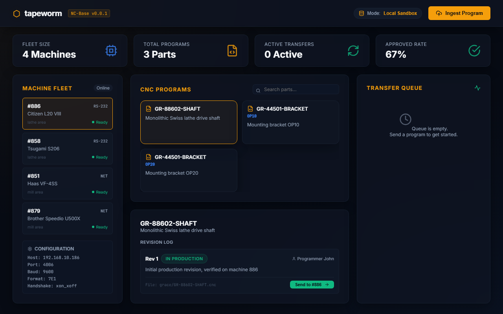
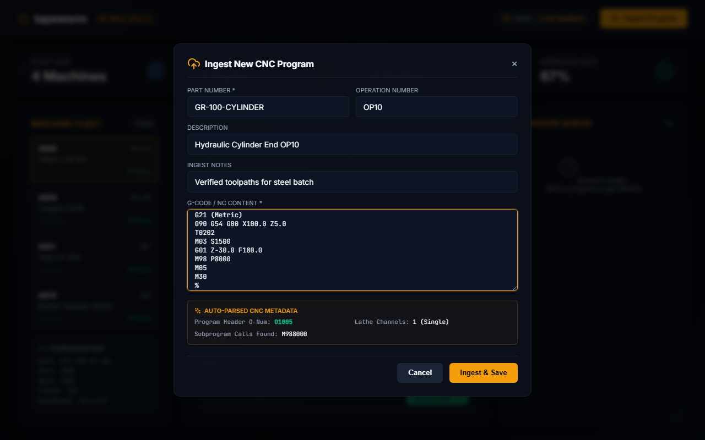
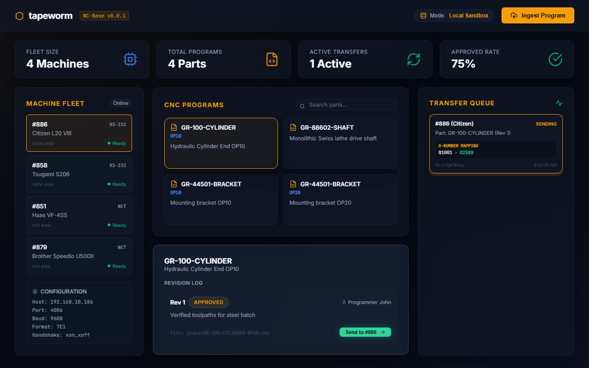

# Tapeworm — CNC NC-Base Platform

> A modern, Supabase-backed G-code library, dynamic O-number rewriter, and real-time serial transfer platform for CNC machine shops.

Tapeworm closes the loop between **Autodesk Fusion → Git ➔ Supabase Database ➔ The Machine Tool Control**. It provides a central, versioned repository of proven programs, manages per-machine O-number namespaces, resolves subprogram dependencies, and streams G-code over RS-232, Ethernet, or USB gadget interfaces.

---

## Workspace Architecture

Tapeworm is built as a unified TypeScript `pnpm` monorepo orchestrating the web frontend, background transfer agent, and shared packages:

```
tapeworm/
├── apps/
│   ├── web/               # React + Vite cockpit dashboard (glassmorphic dark UI)
│   └── agent/             # Transfer agent (subscribes to Supabase Realtime, rewrites O-nums)
├── packages/
│   ├── shared/            # Common domain model types (@tapeworm/shared)
│   └── mcp-server/        # Model Context Protocol (MCP) server for AI clients
├── core/                  # tapeworm-core — Rust crate for direct serial RS-232 I/O
├── supabase/              # Local Supabase configuration, seed data, and schema migrations
└── pnpm-workspace.yaml    # Monorepo workspaces definition
```

---

## Technical Features

### 1. Database-Native CNC Management (NC-Base)
Tapeworm uses a relational PostgreSQL schema (managed locally via Supabase) to keep track of:
- **Machines**: Location, control families (Fanuc, Mitsubishi, Haas, Brother), transfer modes (RS-232, Net Share, USB gadget), and connection profiles.
- **Programs & Revisions**: Fully versioned program history. Tracks approvals (`Draft` ➔ `Approved` ➔ `In Production`), file sizes, SHA-256 hashes, and tool list documents.
- **Dependency Graph**: Directed relationships between programs (e.g. parent program calling child subprograms).
- **Assignments (O-Number Namespaces)**: Maps logical part numbers to machine-specific `O-numbers` (1–9999). Assigned once, permanent, and unique within each machine's namespace.
- **Audit Logs**: Immutable transfer logs recording timestamps, users, bytes sent, and rewritten O-number maps.

### 2. G-Code Parser & Dynamic O-Number Rewriter
CNCs demand specific program numbers in their memory namespace, but developers prefer human-readable filenames (e.g. `grace-part123.cnc`). Tapeworm bridges this gap at the moment of transfer:
- **Ingest Parsing**: Analyzes uploaded G-code files to extract defined headers (e.g. `O1001`), Citizen Swiss lathe multi-channel layout (`$1` main, `$2` sub, `$0` barfeed parameters), and external subprogram calls (`M98 P2005` or `G65 P1002`). Ignores local label sequence jumps (`M98 H100`) and highlights machine-resident macros (e.g. `P8000`).
- **Dynamic Swapping**: When a transfer is queued, the system gathers all subprogram dependencies, assigns free O-numbers on the target machine namespace, and rewrites program headers and `M98/G65` call sites atomically before streaming.
- **Reverse Mapping**: Program uploads or edits coming back from the machine tool are matched against the transfer's O-number mapping to update the correct versioned program in the library.

---

## Getting Started

### Prerequisites
- [Node.js](https://nodejs.org/) v20 or higher
- [pnpm](https://pnpm.io/) v9 or higher
- [Docker](https://www.docker.com/) (for running Supabase and local services)

### Installation
Install workspace dependencies and compile the packages:
```bash
# Install dependencies
pnpm install

# Approve compilation of native dependencies (esbuild, serialport)
pnpm approve-builds

# Compile all workspaces (shared package, agent, mcp, web)
pnpm build
```

### Running Local Development
1. **Initialize Supabase**:
   Start your local Supabase services:
   ```bash
   npx supabase start
   ```
2. **Apply Migrations and Seed Data**:
   Apply the database schema and seed the 44 Grace Engineering machines:
   ```bash
   npx supabase db reset
   ```
3. **Start Development Servers**:
   Run the Vite frontend and transfer agent concurrently using Turborepo:
   ```bash
   pnpm dev
   ```
   Open your browser and navigate to `http://localhost:3000`.

---

## Local Sandbox Simulation Mode

If you are developing without physical serial hardware (Moxa NPort servers) or a live Supabase database:
- **Sandbox Mode Toggle**: Click the **Mode** pill in the top header of the web dashboard to switch to `Local Sandbox`.
- **Mock Ingestion**: Click **Ingest Program** and paste sample G-code containing channel delimiters (`$1`, `$2`) or subroutine calls. The UI will instantly display the auto-parsed CNC metadata.
- **Simulated Queue**: Click **Send** to queue a transfer. The right-hand panel will display the O-number substitution maps and animate the status transition (`queued` ➔ `sending` ➔ `complete`) with real-time logs.

### Application Screenshots

#### 1. Unified Cockpit Dashboard


#### 2. Auto-parsing Ingest Modal


#### 3. Real-time Transfer queue with Dynamic O-number mappings


---

## Contributing
Please see `CONTRIBUTING.md` for our licensing intentions, CLA details, and code contribution guidelines.

## License
MIT (planned). See `LICENSE` once added.
